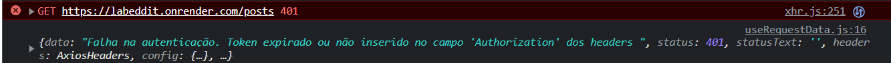
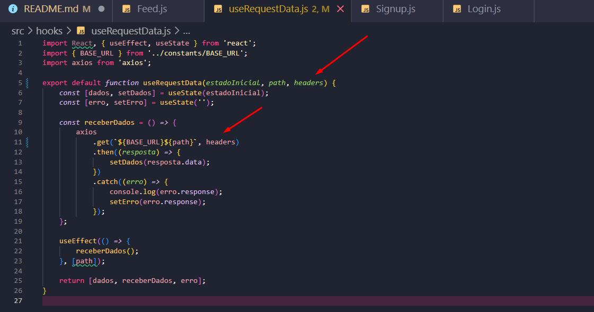

# Template prática guiada Autenticação no React:

## Índice

-   [1. Prática 1](#prática-1)
-   [2. Prática 2](#prática-2)
-   [3. Prática 3](#prática-3)
-   [4. Prática 4](#prática-4)
-   [4. Fixação](#fixação)

## Prática 1

-   Em `Signup.js` , na função `enviarCadastro`:

    ```
        const enviarCadastro = (e) => {
            e.preventDefault();
            if (form.senha === form.confirmaSenha) {
                const dadosUsuario = {
                    username: form.nomeUsuario,
                    email: form.email,
                    password: form.senha,
                };
                console.log(dadosUsuario);
                axios
                    .post(`${BASE_URL}/users/signup`, dadosUsuario)
                    .then((resp) => {
                        console.log(resp.data.token);
                        localStorage.setItem('token', resp.data.token);
                        irParaFeed(navigate);
                    })
                    .catch((error) => {
                        console.log(error.response.data);
                        alert(error.response.data);
                    });
            } else {
                alert(
                    "Digite a mesma senha nos campos 'senha' e 'confirmação de senha'"
                );
            }
        };
    ```

-   Importar o `useNavigate()` e armazenar em uma variável:

    ```
        const navigate = useNavigate();
    ```

## Prática 2

-   Em `Login.js` na função `enviaLogin`:

    ```
        const enviaLogin = (e) => {
            e.preventDefault();
            console.log(form);

            const body = {
                email: form.email,
                password: form.password,
            };

            axios
                .post(`${BASE_URL}/users/login`, body)
                .then((resp) => {
                    console.log(resp.data.token);
                    localStorage.setItem('token', resp.data.token);
                    irParaFeed(navigate);
                })
                .catch((err) => {
                    console.log(err);
                });
        };
    ```

## Prática 3

-   Em `useRequestData.js`, está acontecendo um erro:

-   

-   O código em questão atualmente é esse:

    ```
    import React, { useEffect, useState } from 'react';
    import { BASE_URL } from '../constants/BASE_URL';
    import axios from 'axios';

    export default function useRequestData(estadoInicial, path) {
        const [dados, setDados] = useState(estadoInicial);
        const [erro, setErro] = useState('');

        const receberDados = () => {
            axios
                .get(`${BASE_URL}${path}`)
                .then((resposta) => {
                    setDados(resposta.data);
                })
                .catch((erro) => {
                    console.log(erro.response);
                    setErro(erro.response);
                });
        };

        useEffect(() => {
            receberDados();
        }, [path]);

        return [dados, receberDados, erro];
    }

    ```

-   É preciso passar o `Headers` para o `useRequestData` que é o token:



-   Em `Feed.js`:

    ```
        const tokenLogado = localStorage.getItem('token');

        const config = {
            headers: {
                Authorization: tokenLogado,
            },
        };

        const [posts] = useRequestData([], '/posts', config);
    ```

## Prática 4

## Fixação
